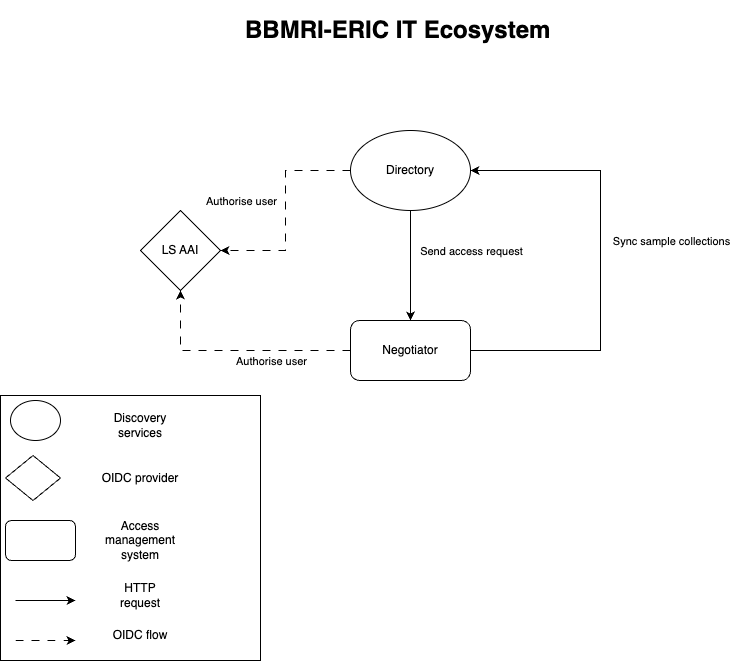

# Negotiator


[](https://codecov.io/github/BBMRI-ERIC/negotiator-v3)


Negotiator, an open-source system for streamlining access request workflows in multinational
environments.
Allows defining a custom workflow engine, provides a REST API for interaction with requests and
features
for moderation on national level.

<!-- TOC -->
* [Negotiator](#negotiator)
  * [Goal](#goal)
  * [State](#state)
  * [Key domain terms:](#key-domain-terms)
  * [Quick Start](#quick-start)
  * [Development](#development)
    * [Prerequisites](#prerequisites)
    * [Running the backend in dev mode](#running-the-backend-in-dev-mode)
    * [Connection URL for the H2 database](#connection-url-for-the-h2-database)
    * [Architecture](#architecture)
  * [Integration](#integration)
  * [License](#license)
<!-- TOC -->

## Goal

The goal of this project is to provide a highly customizable system, featuring an access control
mechanism
for structuring and streamlining the process of access requests for resources under the jurisdiction
of different
organizations spanning multiple nations and, each with their own legislation.

## State

Negotiator is currently used for mediating access to biological data and samples in BBMRI-ERIC.
Using one of BBMRI-ERIC
discovery services such as the [Directory](https://directory.bbmri-eric.eu/#/) or
the [GBA SampleLocator](https://samplelocator.bbmri.de/) researchers
can browse and locate collections of bio specimens, and then request access
via [BBMRI-ERIC Negotiator](https://negotiator.bbmri-eric.eu/)
by filling out a request form and then following individual steps of the Negotiation lifecycle.
This is a new implementation of the Negotiator, version 3.0.0 and is still under active development.
Reference UI implementation for BBMRI can be found in
this [repository](https://github.com/BBMRI-ERIC/negotiator-v3-frontend).
Documentation for
the new REST API can be found [here](https://negotiator-v3.bbmri-eric.eu/api/swagger-ui/index.html).
An older version of this service can be found in
this [repository](https://github.com/BBMRI-ERIC/negotiator.bbmri).

## The Negotiator as an Access Management System:

### Key Domain entities:

- **Resource**: Any resource/entity that is listed in an external discovery
  service, and has a unique and persistent identifier.
  (e.g., collection of biological samples, research service, specialized treatment...)
- **Request**: A depiction of a query from a data discovery service specifying the resource/resources of
  interest and filtering criteria used to find them in the discovery service.
- **Negotiation**: An access application consisting of one or multiple requests that is linked to an authenticated
  user.
- **Representative**: A physical person responsible for mediating access to a resource in their
  jurisdiction.

### Basic usage example

Using an external discovery service connected to the Negotiator,
the user identifies resources they are interested in getting access to, and passes them as a Request to the Negotiator.
Once authenticated, the user then fills out a resource-specific access form and submits the request for review.
Once the request is approved by an administrator, it becomes a Negotiation where resource representatives,
moderators and the requester can interact with it.

## Quick Start

The following command will run the Negotiator application with the REST API exposed
at [port 8080](http://localhost:8080)
Note: The authentication using OIDC mock server will not work because of issues with docker network,
unless the OIDC
mock is running
on an external server.

```shell
docker run --rm -e PROFILE=dev -p 8080:8081 bbmrieric/negotiator:latest
```

## Development

For contributing, please read our [contribution guidelines](docs/CONTRIBUTING.md).

### Prerequisites

- Java 17
- Maven
- Spring

### Running the backend in dev mode

```shell
mvn clean package
java -jar -Dspring.profiles.active=dev target/negotiator.jar
```

The dev mode exposes a relational database, details can be found below.
### Connection URL for the H2 database

Default credentials are: negotiator:negotiator
``
jdbc:h2:tcp://localhost:9092/mem:negotiator
``

### Architecture

Negotiator follows a classic repository-service architectural pattern. Key components:

- [REST API](docs/REST.md)
- [Workflow engine](docs/LIFECYCLE.md)
- [Notification service](docs/NOTIFICATIONS.md)
- [External services interface](docs/EXTERNAL_SERVICES.md)

## Integration

The diagram below shows an oversimplified version of where does the Negotiator fit in, in relation
to other
BBMRI-ERIC IT services.


## License

Copyright 2020-2023 [BBMRI-ERIC](https://bbmri-eric.eu).

Licensed under GNU Affero General Public License v3.0 (the "License");
you may not use this file except in compliance with the License.

Unless required by applicable law or agreed to in writing, software distributed under the License is
distributed on an "AS IS" BASIS, WITHOUT WARRANTIES OR CONDITIONS OF ANY KIND, either express or
implied. See the License for the specific language governing permissions and limitations under the
License.
