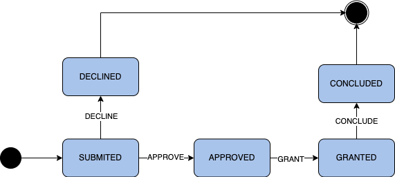

# Negotiation lifecycle management

<!-- TOC -->
* [Negotiation lifecycle management](#negotiation-lifecycle-management)
  * [Intro](#intro)
  * [Implementation](#implementation)
<!-- TOC -->
## Intro
The Negotiator features a finite state machine for manipulating the lifecycle of each Negotiation. Here is a very simple
example of how a simple state machine in this context can look like:

## Implementation
The Negotiator uses the [Spring state machine framework](https://docs.spring.io/spring-statemachine/docs/current/reference/#preface)
for handling the exact implementation of the workflow engine. Updating of the appropriate entities is handled
by following the [Persist](https://docs.spring.io/spring-statemachine/docs/current/reference/#statemachine-recipes-persist)
recipe/pattern.