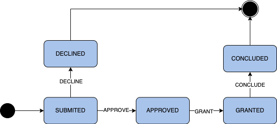

# Negotiation lifecycle management

<!-- TOC -->

* [Negotiation lifecycle management](#negotiation-lifecycle-management)
    * [Intro](#intro)
    * [Usage](#usage)
    * [Implementation](#implementation)
        * [Configuration](#configuration)

<!-- TOC -->

## Intro

The Negotiator features mechanisms for 2 finite state machines.
One for manipulating the lifecycle of each Negotiation, and the second
one is for managing the lifecycle of individual Resources that are a part of a Negotiation.
Here is an example of what a basic state machine in the context of Negotiation Lifecycle can look
like:

## Usage

Interactions with the state machine are currently handled only via the REST API.
This means that the entire lifecycle is represented in a machine-readable way enabling automated
interactions.

## Implementation

The Negotiator uses
the [Spring state machine framework](https://docs.spring.io/spring-statemachine/docs/current/reference/#preface)
for handling the exact implementation of the workflow engine. Updating of the appropriate entities
is handled
by following
the [Persist](https://docs.spring.io/spring-statemachine/docs/current/reference/#statemachine-recipes-persist)
recipe/pattern.

### Configuration

Currently,
the configuration for the Negotiation lifecycle workflow is hardcoded
in `NegotiationStateMachineConfig.java`.
